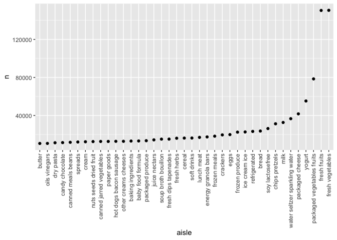
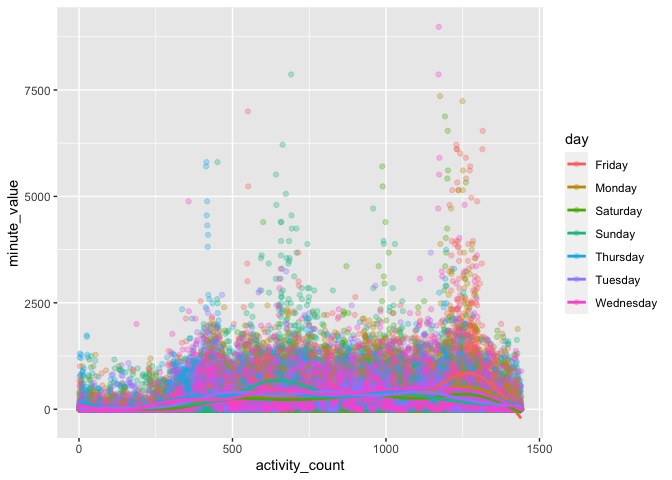

p8105\_hw3\_yl4362
================

``` r
library(tidyverse)
library(ggridges)
library(p8105.datasets)
```

## Problem 1

**description of the dataset**

``` r
data("instacart")
```

This dataset contains 1384617 rows and 15 columns.

Observations are the level of products in orders by user. There are user
/ order variables – user ID, order ID, order day, and order hour. There
are also product variables – product ID, name, aisle, department, and
some numeric codes.

**answers** 1) How many aisles are there, and which aisles are the most
items ordered from?

``` r
instacart %>%
  count(aisle) %>%
  arrange(desc(n))
```

    ## # A tibble: 134 x 2
    ##    aisle                              n
    ##    <chr>                          <int>
    ##  1 fresh vegetables              150609
    ##  2 fresh fruits                  150473
    ##  3 packaged vegetables fruits     78493
    ##  4 yogurt                         55240
    ##  5 packaged cheese                41699
    ##  6 water seltzer sparkling water  36617
    ##  7 milk                           32644
    ##  8 chips pretzels                 31269
    ##  9 soy lactosefree                26240
    ## 10 bread                          23635
    ## # … with 124 more rows

There are 134 aisles. The aisles of `fresh vegtables`, `fresh fruits`,
and `packaged vegetables fruits` are the most items ordered from.

2)  Make a plot that shows the number of items ordered in each aisle,
    limiting this to aisles with more than 10000 items ordered. Arrange
    aisles sensibly, and organize your plot so others can read it.

<!-- end list -->

``` r
instacart %>%
  count(aisle) %>%
  filter(n > 10000) %>%
  mutate(
    aisle = factor(aisle),
    aisle = fct_reorder(aisle, n)
  ) %>%
  ggplot(aes(x = aisle, y = n)) +
  geom_point() + 
  theme(axis.text.x = element_text(angle = 90, vjust = 0.5, hjust = 1))
```

<!-- -->

3)  Make a table showing the three most popular items in each of the
    aisles “baking ingredients”, “dog food care”, and “packaged
    vegetables fruits”. Include the number of times each item is ordered
    in your table.

<!-- end list -->

``` r
instacart %>%
  filter(aisle %in% c("baking ingredients", "dog food care", "packaged vegetables fruits")) %>%
  group_by(aisle) %>%
  count(product_name) %>%
  mutate(rank = min_rank(desc(n))) %>%
  filter(rank < 4) %>%
  arrange(aisle, rank) %>%
  knitr::kable()
```

| aisle                      | product\_name                                 |    n | rank |
| :------------------------- | :-------------------------------------------- | ---: | ---: |
| baking ingredients         | Light Brown Sugar                             |  499 |    1 |
| baking ingredients         | Pure Baking Soda                              |  387 |    2 |
| baking ingredients         | Cane Sugar                                    |  336 |    3 |
| dog food care              | Snack Sticks Chicken & Rice Recipe Dog Treats |   30 |    1 |
| dog food care              | Organix Chicken & Brown Rice Recipe           |   28 |    2 |
| dog food care              | Small Dog Biscuits                            |   26 |    3 |
| packaged vegetables fruits | Organic Baby Spinach                          | 9784 |    1 |
| packaged vegetables fruits | Organic Raspberries                           | 5546 |    2 |
| packaged vegetables fruits | Organic Blueberries                           | 4966 |    3 |

4)  Make a table showing the mean hour of the day at which Pink Lady
    Apples and Coffee Ice Cream are ordered on each day of the week;
    format this table for human readers (i.e. produce a 2 x 7 table).

<!-- end list -->

``` r
instacart %>%
  filter(product_name %in% c("Pink Lady Apples", "Coffee Ice Cream")) %>%
  group_by(product_name, order_dow) %>%
  summarize(mean_hour = mean(order_hour_of_day)) %>%
  pivot_wider(
    names_from = order_dow,
    values_from = mean_hour
  ) %>%
  knitr::kable()
```

    ## `summarise()` regrouping output by 'product_name' (override with `.groups` argument)

| product\_name    |        0 |        1 |        2 |        3 |        4 |        5 |        6 |
| :--------------- | -------: | -------: | -------: | -------: | -------: | -------: | -------: |
| Coffee Ice Cream | 13.77419 | 14.31579 | 15.38095 | 15.31818 | 15.21739 | 12.26316 | 13.83333 |
| Pink Lady Apples | 13.44118 | 11.36000 | 11.70213 | 14.25000 | 11.55172 | 12.78431 | 11.93750 |

## Problem 2

1)  Load, tidy, and otherwise wrangle the data. Your final dataset
    should include all originally observed variables and values; have
    useful variable names; include a weekday vs weekend variable; and
    encode data with reasonable variable classes. Describe the resulting
    dataset (e.g. what variables exist, how many observations, etc).

<!-- end list -->

``` r
accel_data = 
  read_csv("./data/accel_data.csv") %>%
  janitor::clean_names() %>%
  pivot_longer(
    cols = starts_with("activity"),
    names_to = "activity_count",
    names_prefix = "activity.",
    values_to = "minute_value") %>%
  mutate(
    weekday_vs_weekend = case_when(
           day == "Monday" ~ "weekday",
           day == "Tuesday" ~ "weekday",
           day == "Wednesday" ~ "weekday",
           day == "Thursday" ~ "weekday",
           day == "Friday" ~ "weekday",
           day == "Saturday"~ "weekend",
           day == "Sunday"~ "weekend"),
    activity_count = as.numeric(activity_count)
    )
```

    ## Parsed with column specification:
    ## cols(
    ##   .default = col_double(),
    ##   day = col_character()
    ## )

    ## See spec(...) for full column specifications.

This dataset contains 50400 observations and 6 variables.

There are activity variables - count, value in a minute, day, weekday vs
weekend, day ID, week ID, day of the week.

2)  Traditional analyses of accelerometer data focus on the total
    activity over the day. Using your tidied dataset, aggregate accross
    minutes to create a total activity variable for each day, and create
    a table showing these totals. Are any trends apparent?

<!-- end list -->

``` r
accel_data %>% 
  group_by(day_id) %>%
  summarize(total_activity = sum(minute_value)) %>%
  knitr::kable()
```

    ## `summarise()` ungrouping output (override with `.groups` argument)

| day\_id | total\_activity |
| ------: | --------------: |
|       1 |       480542.62 |
|       2 |        78828.07 |
|       3 |       376254.00 |
|       4 |       631105.00 |
|       5 |       355923.64 |
|       6 |       307094.24 |
|       7 |       340115.01 |
|       8 |       568839.00 |
|       9 |       295431.00 |
|      10 |       607175.00 |
|      11 |       422018.00 |
|      12 |       474048.00 |
|      13 |       423245.00 |
|      14 |       440962.00 |
|      15 |       467420.00 |
|      16 |       685910.00 |
|      17 |       382928.00 |
|      18 |       467052.00 |
|      19 |       371230.00 |
|      20 |       381507.00 |
|      21 |       468869.00 |
|      22 |       154049.00 |
|      23 |       409450.00 |
|      24 |         1440.00 |
|      25 |       260617.00 |
|      26 |       340291.00 |
|      27 |       319568.00 |
|      28 |       434460.00 |
|      29 |       620860.00 |
|      30 |       389080.00 |
|      31 |         1440.00 |
|      32 |       138421.00 |
|      33 |       549658.00 |
|      34 |       367824.00 |
|      35 |       445366.00 |

I can tell from the table that in the day 4, 10, 16, 29, there are over
600,000 total activity. And in the day 24 and 31, the total activity is
the least.

3)  Accelerometer data allows the inspection activity over the course of
    the day. Make a single-panel plot that shows the 24-hour activity
    time courses for each day and use color to indicate day of the week.
    Describe in words any patterns or conclusions you can make based on
    this graph.

<!-- end list -->

``` r
accel_data %>%
  ggplot(aes(x = activity_count, y = minute_value, color = day)) +
  geom_point(alpha = .3) + 
  geom_smooth(se = FALSE)
```

    ## `geom_smooth()` using method = 'gam' and formula 'y ~ s(x, bs = "cs")'

<!-- -->

From the plot, I notified that the activity arises as the
activity\_count goes up. Friday and Sunday have the most high
minute\_value.

## Problem 3

1)  Do some data cleaning. Create separate variables for year, month,
    and day. Ensure observations for temperature, precipitation, and
    snowfall are given in reasonable units. For snowfall, what are the
    most commonly observed values? Why?

<!-- end list -->

``` r
data("ny_noaa")

ny_noaa %>%
  dplyr::mutate(year = lubridate::year(date), 
                month = lubridate::month(date), 
                day = lubridate::day(date)) %>%
  mutate(
    tmax = as.numeric(tmax) / 10,
    tmin = as.numeric(tmin) / 10)
```

    ## # A tibble: 2,595,176 x 10
    ##    id          date        prcp  snow  snwd  tmax  tmin  year month   day
    ##    <chr>       <date>     <int> <int> <int> <dbl> <dbl> <dbl> <dbl> <int>
    ##  1 US1NYAB0001 2007-11-01    NA    NA    NA    NA    NA  2007    11     1
    ##  2 US1NYAB0001 2007-11-02    NA    NA    NA    NA    NA  2007    11     2
    ##  3 US1NYAB0001 2007-11-03    NA    NA    NA    NA    NA  2007    11     3
    ##  4 US1NYAB0001 2007-11-04    NA    NA    NA    NA    NA  2007    11     4
    ##  5 US1NYAB0001 2007-11-05    NA    NA    NA    NA    NA  2007    11     5
    ##  6 US1NYAB0001 2007-11-06    NA    NA    NA    NA    NA  2007    11     6
    ##  7 US1NYAB0001 2007-11-07    NA    NA    NA    NA    NA  2007    11     7
    ##  8 US1NYAB0001 2007-11-08    NA    NA    NA    NA    NA  2007    11     8
    ##  9 US1NYAB0001 2007-11-09    NA    NA    NA    NA    NA  2007    11     9
    ## 10 US1NYAB0001 2007-11-10    NA    NA    NA    NA    NA  2007    11    10
    ## # … with 2,595,166 more rows

``` r
ny_noaa %>%
  count(snow) %>%
  arrange(desc(n))
```

    ## # A tibble: 282 x 2
    ##     snow       n
    ##    <int>   <int>
    ##  1     0 2008508
    ##  2    NA  381221
    ##  3    25   31022
    ##  4    13   23095
    ##  5    51   18274
    ##  6    76   10173
    ##  7     8    9962
    ##  8     5    9748
    ##  9    38    9197
    ## 10     3    8790
    ## # … with 272 more rows

For snowfall, the most commonly observed values are ‘0’ and ‘NA’. I
think it is because the days without snowfall in a year is much more
than the days with snowfall.

2)  Make a two-panel plot showing the average max temperature in January
    and in July in each station across years. Is there any observable /
    interpretable structure? Any outliers?

3)  Make a two-panel plot showing (i) tmax vs tmin for the full dataset
    (note that a scatterplot may not be the best option); and (ii) make
    a plot showing the distribution of snowfall values greater than 0
    and less than 100 separately by year.

This dataset contains 2595176 observations and 7 variables.

There are activity variables - count, value in a minute, day, weekday vs
weekend, day ID, week ID, day of the week.
